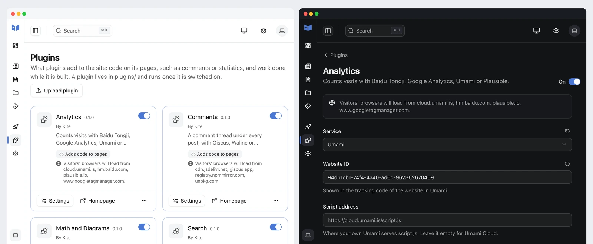

<p align="center">
  
</p>

<h1 align="center">访问统计</h1>

<p align="center">
  用你已经在用的统计服务，统计 Kite 网站的访问量。
</p>

<p align="center">
  <a href="https://github.com/kite-plus/plugin-analytics/actions/workflows/ci.yml"></a>
  <a href="https://github.com/kite-plus/plugin-analytics/releases/latest"></a>
  <a href="https://github.com/kite-plus/kite"></a>
  <a href="LICENSE"></a>
</p>

<p align="center">
  <a href="README.md">English</a> · 简体中文
</p>

<p align="center">
  
</p>

访问统计是 [Kite](https://github.com/kite-plus/kite) 的官方插件。在后台选好统计服务，填上服务给你的 ID，网站的每个页面就都会被统计。

<p>
  
  
  
  
</p>

## 特点

- **四种服务，一个下拉框**：百度统计、Google Analytics、Umami 和 Plausible；Umami 和 Plausible 既可以用官方云服务，也可以用自己部署的。
- **本机预览不计数**：在 `localhost` 上预览时不会被统计，除非你在设置里打开。
- **说清楚会加载什么**：开启插件之前，后台会列出访客的浏览器将从哪些网站加载内容。
- **不拖慢构建**：插件只往页面里加一小段代码，构建时间和原来一样。

## 安装

1. 从[最新版本](https://github.com/kite-plus/plugin-analytics/releases/latest)下载 `analytics-<版本>.zip`。
2. 在 Kite 后台打开「插件」，把 zip 拖到「上传插件」上，然后打开开关。

也可以在站点目录里用命令行：

```sh
kite plugin add analytics-0.1.0.zip
kite plugin enable analytics
```

需要 Kite 1.0 及以上版本。

## 设置

在「插件 → 访问统计 → 设置」里，表单只显示所选服务需要填写的项。

| 设置 | 服务 | 说明 |
|---|---|---|
| 统计服务 | | 百度统计、Google Analytics、Umami 或 Plausible |
| 站点代码 | 百度统计 | 百度统计给出的代码里 `hm.js?` 后面那一串 |
| 衡量 ID | Google Analytics | `G-XXXXXXXXXX`，网站数据流的 ID |
| 网站 ID | Umami | Umami 里该网站跟踪代码中的 ID |
| 脚本地址 | Umami | 自己部署的 Umami 提供 `script.js` 的地址；用 Umami Cloud 时留空 |
| 域名 | Plausible | 网站在 Plausible 中登记的域名；留空时使用访问时的域名 |
| 脚本地址 | Plausible | 自己部署的 Plausible 提供脚本的地址；用 plausible.io 时留空 |
| 统计本机预览 | | 在 `localhost` 预览时也计入访问；默认关闭 |

## 发布新版本

修改 `plugin.yaml` 里的 `version` 并提交，然后推送同名的标签，例如 `v0.1.0`。发布工作流会打包 `dist/analytics-<版本>.zip` 并附到 GitHub Release 上。在本地运行 `make zip` 可以打出同样的文件，`kite plugin verify .` 会按站点加载插件的方式检查它。

## 其他官方插件

| 插件 | 作用 |
|---|---|
| [评论](https://github.com/kite-plus/plugin-comments) | 在每篇文章下放评论区，支持 Giscus、Waline 和 Twikoo |
| [公式与图表](https://github.com/kite-plus/plugin-math) | 用 KaTeX 排版 TeX 公式，把 mermaid 代码块画成图表 |
| [站内搜索](https://github.com/kite-plus/plugin-search) | 在读者的浏览器里搜索，不需要运行任何服务 |

## 许可证

[Apache License 2.0](LICENSE)。
